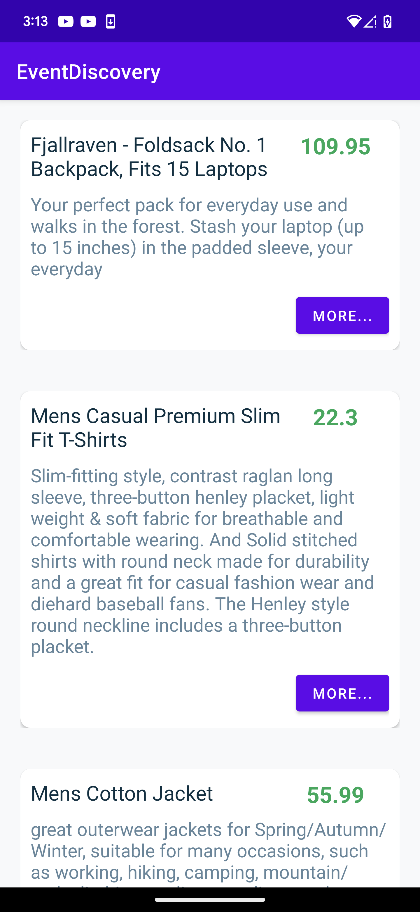
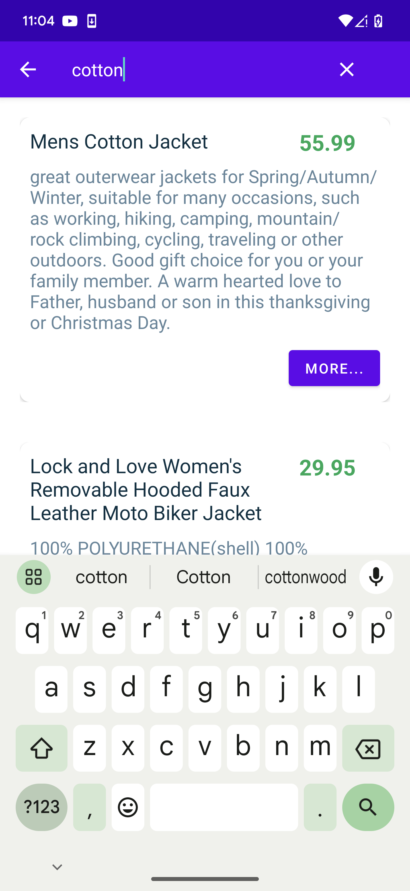

# EventDiscovery

## Single screen app written in Kotlin

MVVM design pattern
Observable Properties or LiveData: The ViewModel exposes observable properties or LiveData objects to the View. This enables the View to observe changes in the data and automatically update itself

## Testability
MVVM promotes testability by separating the business logic from the UI. Unit tests can be written for the ViewModel to ensure that the logic and data transformations are working correctly.

## Room database 
Databse to store event data fetched from the API

## Retrofit 
a popular open-source library for Android app development that simplifies the process of making HTTP requests and handling network communication. It is widely used for building RESTful APIs and retrieving data from web services.

## Glide 
load images using Glide library

## Dagger-Hilt 
for dependency injection - use dependency injection to get ride of boilder plate code.

## Coroutines 
you can write asynchronous code in a sequential and more readable manner. Coroutines use suspending functions, which can be paused and resumed, allowing you to write code that looks like sequential execution even though it's asynchronous.</li>

## JUnit, expresso - 
for UI/Unit testing

## App Screenshot

